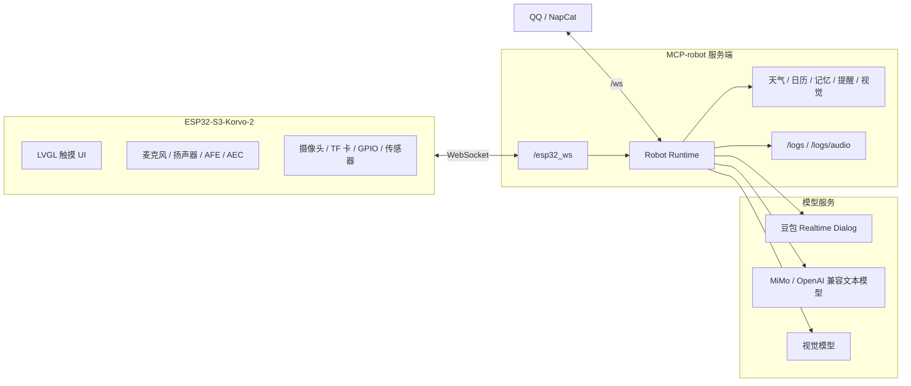

# MCP-ESP32

基于 ESP32-S3-Korvo-2 的多模态机器人项目，包含端侧 ESP-IDF/ADF 固件、Python MCP 服务端、QQ/NapCat 桥接、语音交互、拍照识别、提醒、音乐控制和硬件状态管理。

本仓库是面向公开发布整理后的工程快照。仓库中不包含真实密钥、本地运行数据、构建产物、虚拟环境和个人部署配置。

## 项目状态

| 模块 | 说明 |
| --- | --- |
| 端侧硬件 | ESP32-S3-Korvo-2 V3 |
| 固件框架 | ESP-IDF / ESP-ADF |
| 语音链路 | ESP-SR 2.4.6 AFE/AEC + 豆包 Realtime Dialog |
| 文本链路 | QQ/NapCat + MiMo 或 OpenAI 兼容模型 |
| 服务端 | FastAPI + WebSocket |
| 主要能力 | 全双工语音、打断、TTS、拍照识别、TF 卡音乐、天气日历、提醒、记忆、硬件控制 |

## 功能亮点

- ESP32-S3-Korvo-2 固件，支持麦克风、扬声器、触摸屏、TF 卡、摄像头和 GPIO 扩展。
- 基于 Espressif ESP-SR 2.4.6 的全双工 AFE/AEC 候选链路。
- 支持 WakeNet、VAD gate、barge-in 打断、异步音频上传和 TTS 下行播放。
- LVGL 触摸 UI，包含主控、天气、日历、音乐、网络、设置和调试页面。
- MCP 服务端负责模型调度、工具调用、记忆、提醒、视觉分析和设备命令转发。
- QQ/NapCat 文本聊天与 ESP32 语音链路分离，便于调试和演示。
- 提供 `/logs` 分类日志页面和 `/logs/audio` 音频波形页面，便于排查录音、ASR 和 TTS 问题。

## 系统架构



## 仓库结构

```text
.
├── esp32idf-robot/     # ESP32-S3-Korvo-2 固件
├── MCP-robot/          # Python MCP 服务端和机器人运行时
├── GenericAgent/       # 可选的通用 Agent/命令执行桥
├── bootmain/           # 可选 NapCat 启动辅助文件
├── docs/               # 工程笔记、配置说明和调试报告
├── CHANGELOG.md        # 版本记录和验证历史
└── README.md
```

## 硬件要求

- ESP32-S3-Korvo-2 V3 开发板。
- 稳定 USB 数据线和可用串口。
- 与 ESP32 处于同一网络的电脑或服务器。
- 可选：摄像头、TF 卡、灯光/传感器 GPIO 模块、NapCat/QQ 环境。

公开仓库中的固件配置默认关闭外接演示硬件，因此即使没有额外接线也可以编译。

## 软件要求

固件侧：

- ESP-IDF 5.5.x 或兼容的 ESP-IDF 5.x 环境。
- ESP-ADF 相关音频组件。
- ESP-IDF Tools 中的 Python、CMake、Ninja、esptool。
- 目标芯片：`esp32s3`。

服务端：

- Python 3.10 或更高版本。
- `pip`。
- 可选：NapCat，用于 QQ 消息接入。

固件组件依赖声明在 `esp32idf-robot/main/idf_component.yml`：

```yaml
dependencies:
  espressif/esp-sr: "2.4.6"
  lvgl/lvgl: "^8.4.0"
  esp_lcd_touch_gt911: "^1"
  esp_lcd_touch_tt21100: ">=1.0.0"
```

## 快速开始

克隆仓库：

```bash
git clone https://github.com/Sagitta-Aria/MCP-ESP32.git
cd MCP-ESP32
```

创建服务端虚拟环境：

```bash
cd MCP-robot
python -m venv .venv
```

Windows PowerShell：

```powershell
.\.venv\Scripts\Activate.ps1
pip install -r requirements.txt
```

Linux/macOS：

```bash
source .venv/bin/activate
pip install -r requirements.txt
```

复制密钥模板并填写本地配置：

```bash
cp local_keys.example.py local_keys.py
```

启动 MCP 服务端：

```bash
python main.py
```

检查服务状态：

```bash
curl http://127.0.0.1:8080/healthz
```

配置并编译固件：

```bash
cd ../esp32idf-robot
idf.py set-target esp32s3
idf.py build
```

烧录并查看串口：

```bash
idf.py -p COMx flash monitor
```

把 `COMx` 替换为实际串口，例如 Windows 的 `COM3` 或 Linux 的 `/dev/ttyUSB0`。

## 配置说明

### 固件配置

烧录前修改 `esp32idf-robot/main/app_config.h`：

```c
#define ROBOT_WIFI_SSID "YOUR_WIFI_SSID"
#define ROBOT_WIFI_PASSWORD "YOUR_WIFI_PASSWORD"
#define ROBOT_MCP_URI "ws://YOUR_MCP_SERVER_IP:8080/esp32_ws"
#define ROBOT_DEVICE_ID "ESP32_KORVO_2"
```

公开仓库应保留这些占位符，不要提交真实 Wi-Fi、内网地址或公网地址。

音频格式约定：

```c
#define ROBOT_AUDIO_SAMPLE_RATE 16000
#define ROBOT_AUDIO_BITS 16
#define ROBOT_AUDIO_CHANNELS 1
```

ESP32 播放源保持 `16000 Hz / 16-bit / mono`。

### 服务端配置

复制 `MCP-robot/local_keys.example.py` 为 `MCP-robot/local_keys.py`，并只在本地填写真实凭据。

常用配置项：

- `MIMO_API_KEY` / `MIMO_BASE_URL`：MiMo 或 OpenAI 兼容文本模型。
- `ARK_API_KEY` / `ARK_BASE_URL`：火山方舟/OpenAI 兼容接口。
- `DOUBAO_DIALOG_APP_ID` / `DOUBAO_DIALOG_APP_KEY`：豆包 Realtime Dialog 凭据。
- `DOUBAO_DIALOG_RESOURCE_ID`：豆包 Realtime Dialog 资源 ID。
- `AMAP_API_KEY` / `SENIVERSE_API_KEY`：天气和地理信息工具。

生产部署时建议优先使用环境变量或服务器本地密钥文件，不要把真实配置写入 Git。

## 模型路由边界

本项目刻意把语音链路和文本链路分开：

- ESP32 语音请求走豆包 Realtime Dialog。
- QQ/NapCat 文本请求走 MiMo 或其他 OpenAI 兼容文本模型。
- 两条链路可以共享记忆和工具。
- 不要把 QQ 文本请求转到 ESP32 语音模型链路。

这样可以降低音频格式、延迟和工具规划混在一起时的调试难度。

## 主要端点

默认本地端口为 `8080`。

| 端点 | 用途 |
| --- | --- |
| `GET /healthz` | 健康检查和模型/运行时状态 |
| `WS /esp32_ws` | ESP32 固件 WebSocket 连接 |
| `WS /ws` | NapCat/QQ WebSocket 连接 |
| `GET /logs` | 浏览器分类日志 |
| `GET /logs/audio` | 最近录音和 TTS 波形 |
| `GET /webui/?token=...` | 可选 NapCat WebUI 代理 |

## QQ 控制 ESP32

普通 QQ 消息按聊天处理。需要控制 ESP32 时，使用 `esp//` 或 `esp32//` 前缀。

示例：

```text
esp//拍照
esp//播放音乐
esp//停止音乐
esp//下一首
esp//上一首
esp//今天天气
esp//硬件状态
```

当 ESP32 已连接 `/esp32_ws` 时，服务端会把这些消息转换为设备命令。

## 固件说明

当前固件重点是可演示、可调试的全双工语音交互：

- ESP-SR 固定为 `2.4.6`。
- AFE 使用全双工配置。
- AEC 默认采用较保守的 low-cost 配置，以兼顾 ESP32-S3 稳定性。
- 保留播放感知 VAD gate 和本地 barge-in 判断作为兜底。
- 音频上传从 AFE 回调路径中解耦，改为异步队列。
- LVGL 触摸回调中避免直接执行耗时 I2C 操作。

详细版本记录和调试过程见 `CHANGELOG.md` 与 `docs/reports/`。

## 验证命令

服务端：

```bash
cd MCP-robot
python -m py_compile main.py runtime.py models.py app_config.py
python main.py
curl http://127.0.0.1:8080/healthz
```

固件：

```bash
cd esp32idf-robot
idf.py build
idf.py -p COMx flash monitor
```

验证后不要提交固件构建目录或本地运行数据。

## 常见问题

ESP32 无法连接 MCP 服务端：

- 确认开发板和服务端在同一网络。
- 检查 `app_config.h` 中的 `ROBOT_MCP_URI`。
- 确认防火墙允许访问 `8080` 端口。
- 查看服务端日志中是否出现 `/esp32_ws` 连接记录。

TTS 无声或播放异常：

- 确认下发给 ESP32 的音频为 `16000 Hz / 16-bit / mono`。
- 查看串口中的 ES8311/ES7210 初始化日志。
- 打开 `/logs/audio` 检查录音波形、峰值和非零占比。

QQ 指令没有控制开发板：

- 确认 NapCat 已连接服务端 `/ws`。
- 指令使用 `esp//` 或 `esp32//` 前缀。
- 确认 ESP32 当前在线并连接 `/esp32_ws`。

ESP-IDF 组件拉取失败：

- 检查到 Espressif Component Registry 的网络连接。
- 重新执行 `idf.py reconfigure`。
- 不要提交 `managed_components/`，它应由构建系统重新生成。

## 安全说明

请勿提交：

- API Key、Token、SSH 密码、QQ/NapCat 凭据或云服务密钥。
- 真实 Wi-Fi SSID/密码。
- 公开仓库不应出现真实公网 IP 或内网 IP。
- `local_keys.py`、`.env`、`venv/`、`.venv/`、`build/`、`data/`、`debug_logs/`、`managed_components/`。

公开固件配置应保留：

```text
YOUR_WIFI_SSID
YOUR_WIFI_PASSWORD
ws://YOUR_MCP_SERVER_IP:8080/esp32_ws
```

## 贡献

欢迎提交 Issue 或 Pull Request。建议在 PR 中说明：

- 修改内容和动机。
- 如果改动固件，附上 `idf.py build` 结果。
- 如果改动服务端，附上 `py_compile` 或运行检查结果。
- 如果改动协议、端点或配置，说明兼容性影响。

请不要在 PR 中包含生成文件、本地密钥或个人运行数据。

## 许可证

当前仓库根目录尚未声明开源许可证。正式复用、分发或发布衍生项目之前，请先与维护者确认许可证，并在仓库根目录补充 `LICENSE` 文件。
