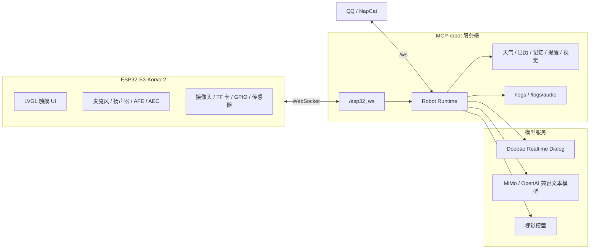

# MCP-ESP32

基于 ESP32-S3-Korvo-2 V3 的多模态语音机器人项目，包含端侧 ESP-IDF/ESP-ADF 固件、Python MCP 服务端、QQ/NapCat 桥接、语音交互、拍照识别、提醒、音乐控制和硬件状态管理。

本仓库是面向公开展示和比赛材料整理后的工程快照。公开仓库不包含真实 Wi-Fi、API Key、Token、本地运行数据、构建产物、虚拟环境和个人部署配置；现场演示请使用本地保留配置的比赛包。

## 项目状态

| 模块 | 说明 |
| --- | --- |
| 端侧硬件 | ESP32-S3-Korvo-2 V3 |
| 固件框架 | ESP-IDF v5.5.3 / ESP-ADF v2.8 |
| 语音链路 | ESP-SR 2.4.6 AFE/AEC + Doubao Realtime Dialog |
| 文本链路 | QQ/NapCat + MiMo 或 OpenAI 兼容模型 |
| 服务端 | Python 3.10+ / FastAPI / WebSocket |
| 主要能力 | 语音对话、打断、TTS、拍照识别、TF 卡音乐、天气日历、提醒、记忆、硬件控制 |

## 功能亮点

- ESP32-S3-Korvo-2 固件，支持麦克风、扬声器、触摸屏、TF 卡、摄像头和 GPIO 扩展。
- 基于 Espressif ESP-SR 2.4.6 的 AFE/AEC 语音采集链路，保留连续对话和打断调试路径。
- MCP 服务端负责模型路由、工具调用、记忆、提醒、视觉分析和设备命令转发。
- QQ/NapCat 文本聊天与 ESP32 语音链路分离，便于演示、调试和降级运行。
- 提供 `/logs` 分类日志页面和 `/logs/audio` 音频波形页面，便于排查录音、ASR 和 TTS 问题。

## 系统架构



## 仓库结构

```text
.
├── esp32idf-robot/     # ESP32-S3-Korvo-2 固件
├── MCP-robot/          # Python MCP 服务端和机器人运行时
├── GenericAgent/       # 可选的通用 Agent/命令执行桥
├── bootmain/           # 可选 NapCat 启动辅助文件
├── docs/               # 工程笔记、配置说明和调试报告
├── CHANGELOG.md        # 版本记录和验证历史
└── README.md
```

## 可复现运行环境

| 项目 | 版本/型号 |
| --- | --- |
| 硬件 | ESP32-S3-Korvo-2 V3 |
| 芯片目标 | `esp32s3` |
| Flash | 16 MB |
| ESP-IDF | v5.5.3 |
| ESP-ADF | v2.8，本地验证 checkout `d049321` |
| ESP-SR | 2.4.6，由 `esp32idf-robot/main/idf_component.yml` 锁定 |
| Python | 3.10+ |

固件组件依赖声明在 `esp32idf-robot/main/idf_component.yml`：

```yaml
dependencies:
  espressif/esp-sr: "2.4.6"
  lvgl/lvgl: "^8.4.0"
  esp_lcd_touch_gt911: "^1"
  esp_lcd_touch_tt21100: ">=1.0.0"
```

## 快速开始

### 1. 启动 Python MCP 服务端

```powershell
cd MCP-robot
python -m venv .venv
.\.venv\Scripts\Activate.ps1
python -m pip install --upgrade pip
pip install -r requirements.txt
Copy-Item local_keys.example.py local_keys.py
# 编辑 local_keys.py，填入自己的模型、天气、地图等 API Key
python -m py_compile main.py runtime.py models.py app_config.py
python main.py
curl http://127.0.0.1:8080/healthz
```

默认服务端口为 `8080`，ESP32 WebSocket 地址为：

```text
ws://<服务端IP>:8080/esp32_ws
```

### 2. 安装 ESP-IDF / ESP-ADF

Windows PowerShell 示例：

```powershell
git clone --recursive -b v2.8 https://github.com/espressif/esp-adf.git D:\Espressif\esp-adf-v2.8
cd D:\Espressif\esp-adf-v2.8\esp-idf
git fetch --tags
git checkout v5.5.3
.\install.ps1 esp32s3
.\export.ps1
$env:ADF_PATH='D:\Espressif\esp-adf-v2.8'
idf.py --version
```

期望 `idf.py --version` 显示 ESP-IDF 5.5.3。构建前必须设置 `ADF_PATH`，因为固件根 `CMakeLists.txt` 会引入 ESP-ADF 组件。

### 3. 配置、编译和烧录固件

```powershell
cd esp32idf-robot
Copy-Item main\app_config.example.h main\app_config.h
# 编辑 main\app_config.h：填写 Wi-Fi 和 MCP WebSocket 地址
$env:IDF_CCACHE_ENABLE='0'
idf.py set-target esp32s3
idf.py build
idf.py -p COM3 flash monitor
```

把 `COM3` 替换为实际串口，例如 Windows 的 `COM3` 或 Linux 的 `/dev/ttyUSB0`。

## 配置说明

### 固件配置

公开仓库中的 `esp32idf-robot/main/app_config.h` 使用占位符：

```c
#define ROBOT_WIFI_SSID "YOUR_WIFI_SSID"
#define ROBOT_WIFI_PASSWORD "YOUR_WIFI_PASSWORD"
#define ROBOT_MCP_URI "ws://YOUR_MCP_SERVER_IP:8080/esp32_ws"
#define ROBOT_DEVICE_ID "ESP32_KORVO_2"
```

公开仓库应保留这些占位符，不要提交真实 Wi-Fi、内网地址、公网地址或比赛现场配置。

### 服务端配置

复制 `MCP-robot/local_keys.example.py` 为 `MCP-robot/local_keys.py`，并只在本地填写真实凭据。常用配置项：

- `MIMO_API_KEY` / `MIMO_BASE_URL`：MiMo 或 OpenAI 兼容文本模型。
- `ARK_API_KEY` / `ARK_BASE_URL`：火山方舟/OpenAI 兼容接口。
- `DOUBAO_DIALOG_APP_ID` / `DOUBAO_DIALOG_APP_KEY`：Doubao Realtime Dialog 凭据。
- `AMAP_API_KEY` / `SENIVERSE_API_KEY`：天气和地理信息工具。

## 模型路由边界

- ESP32 语音请求走 Doubao Realtime Dialog。
- QQ/NapCat 文本请求走 MiMo 或其他 OpenAI 兼容文本模型。
- 两条链路可以共享记忆和工具。
- 不要把 QQ 文本请求转到 ESP32 语音模型链路。

## 主要端点

默认本地端口为 `8080`。

| 端点 | 用途 |
| --- | --- |
| `GET /healthz` | 健康检查和模型/运行时状态 |
| `WS /esp32_ws` | ESP32 固件 WebSocket 连接 |
| `WS /ws` | NapCat/QQ WebSocket 连接 |
| `GET /logs` | 浏览器分类日志 |
| `GET /logs/audio` | 最近录音和 TTS 波形 |
| `GET /webui/?token=...` | 可选 NapCat WebUI 代理 |

## QQ 控制 ESP32

普通 QQ 消息按聊天处理。需要控制 ESP32 时，使用 `esp//` 或 `esp32//` 前缀。

```text
esp//拍照
esp//播放音乐
esp//停止音乐
esp//下一首
esp//上一首
esp//今天天气
esp//硬件状态
```

当 ESP32 已连接 `/esp32_ws` 时，服务端会把这些消息转换为设备命令。

## 验证命令

服务端：

```powershell
cd MCP-robot
python -m py_compile main.py runtime.py models.py app_config.py
python main.py
curl http://127.0.0.1:8080/healthz
```

固件：

```powershell
cd esp32idf-robot
idf.py build
idf.py -p COM3 flash monitor
```

## 比赛提交建议

- 交“重要代码”时可以提交本仓库公开版结构，但不要包含真实 Wi-Fi、密钥、Token、运行数据和构建产物。
- 如果现场演示需要开箱即用，请另准备本地比赛包，保留 `local_keys.py` 和现场 Wi-Fi 配置，但不要公开上传。
- 答辩材料中建议写清楚 ESP-IDF v5.5.3、ESP-ADF v2.8、硬件 ESP32-S3-Korvo-2 V3、依赖安装和烧录命令。

## 常见问题

ESP32 无法连接 MCP 服务端：

- 确认开发板和服务端在同一网络。
- 检查 `app_config.h` 中的 `ROBOT_MCP_URI`。
- 确认防火墙允许访问 `8080` 端口。
- 查看服务端日志中是否出现 `/esp32_ws` 连接记录。

TTS 无声或播放异常：

- 确认下发给 ESP32 的音频为 `16000 Hz / 16-bit / mono`。
- 查看串口中的 ES8311/ES7210 初始化日志。
- 打开 `/logs/audio` 检查录音波形、峰值和非零占比。

QQ 指令没有控制开发板：

- 确认 NapCat 已连接服务端 `/ws`。
- 指令使用 `esp//` 或 `esp32//` 前缀。
- 确认 ESP32 当前在线并连接 `/esp32_ws`。

ESP-IDF 组件拉取失败：

- 检查到 Espressif Component Registry 的网络连接。
- 重新执行 `idf.py reconfigure`。
- 不要提交 `managed_components/`，它应由构建系统重新生成。

## 安全说明

请勿提交：

- API Key、Token、SSH 密码、QQ/NapCat 凭据或云服务密钥。
- 真实 Wi-Fi SSID/密码。
- 公开仓库不应出现真实公网 IP 或内网 IP。
- `local_keys.py`、`.env`、`venv/`、`.venv/`、`build/`、`data/`、`debug_logs/`、`managed_components/`。

公开固件配置应保留：

```text
YOUR_WIFI_SSID
YOUR_WIFI_PASSWORD
ws://YOUR_MCP_SERVER_IP:8080/esp32_ws
```

## 贡献

欢迎提交 Issue 或 Pull Request。建议在 PR 中说明修改内容、固件构建结果、服务端语法检查结果，以及配置或协议兼容性影响。

## 许可证

当前仓库根目录尚未声明开源许可证。正式复用、分发或发布衍生项目之前，请先与维护者确认许可证，并在仓库根目录补充 `LICENSE` 文件。
